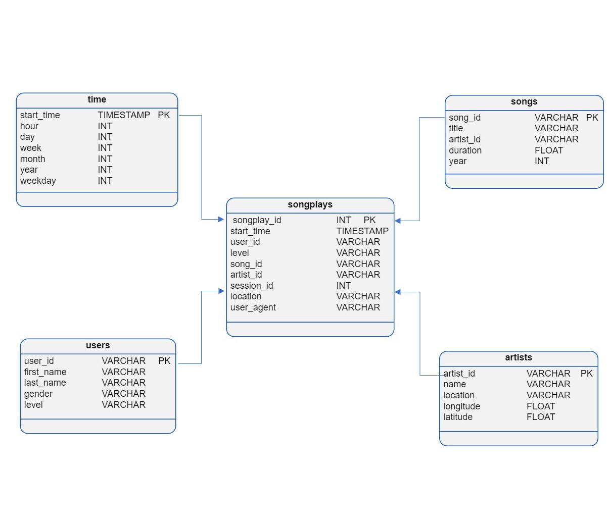

# Data Warehouse Project:

## Introduction:

In this project, we will move the user base and song database onto the cloud. we will build an ETL pipeline that extracts their data (music streaming) from S3, stages them in Redshift, and transforms data into a set of dimensional tables for their analytics team to continue finding insights in what songs their users are listening to. Moreover, we will be using two Amazon Web Services:

- [Amazon Redshift](https://www.youtube.com/watch?v=_qKm6o1zK3U)
- [Amazon S3](https://www.youtube.com/watch?time_continue=9&v=_I14_sXHO8U&feature=emb_title)(Amazon Simple Storage Service ) <br>

> **This project is a part of [Data Engineering Nanodegree](https://www.udacity.com/course/data-engineer-nanodegree--nd027)**

# project files and steps:
 •``IaC.ipynb`` Jupyter notebook for managing the AWS Redshift cluster.
In this file we will be doing some steps: 

* Load DWH Params from a dwh.cfg file.
1-Creating clients for IAM, EC2, S3 and Redshift.
2-read and process files from song_data and log_data in S3 buckets, and check out the sample data sources on S3.
3-Creating an IAM Role that makes Redshift able to access S3 bucket (ReadOnly) using code Infrastructure as Code(IaC).
4-Opening an incoming TCP port to access the cluster endpoint.
5-Checking the connect to the cluster.
6Cleaning up the resources by deleting the Cluster.

•``Sql_queries.py``: includes all of our SQL queries.


•``create_tables.py``: the script to set up the database staging and analytical tables
 
```bash
python create_tables.py
```

•``etl.py``: the etl script to extract data from the files in S3, stage it in redshift, and finally store it in the dimensional tables.

```bash
python etl.py
```

# Star Schema design:

In this project, we used the Star Schema, which is a subset of "fact and dimension tables".
The Star Schema includes one *fact* table (`SongPlays`), and 4 *dimension* tables (`Users`, `Songs`, `Artists`, `Time`)



We used Star Schema in our dataset to denormalized and allowing for simpler queries and quicker aggregations. furthermore, that will help Data Scientists to be able to easily query this dataset and acquiring insights about what songs, artists, and what audiences prefer listening to.


Resources:
- https://www.postgresqltutorial.com/postgresql-to_char/
- https://www.postgresqltutorial.com/postgresql-to_timestamp/
- https://www.postgresqltutorial.com/postgresql-date_part/
- [Data Modeler for Professionals](https://www.vertabelo.com/)
